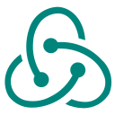
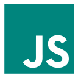
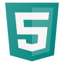
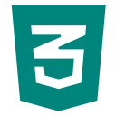
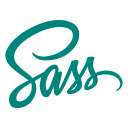
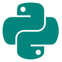
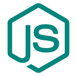
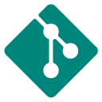

# Aloha, I'm Elysia!  🌺 🌴

I'm a full-stack web developer who's passionate about building beautiful, user-centered and accessible web apps. 

### Currently...
- 👩🏻‍💻  Working on [ReFrame](https://github.com/elysiagabe/reframe), a cognitive reframing app loosely based on CBT techniques
- 🌱  Learning MongoDB, Apollo GraphQL, TypeScript, and more
- ✨  Open to collaboration as well as full-time and freelance opportunities

### Languages, Frameworks & Tools

 
  
  
  
  
 
 
 
 
 
 
 
 

    <em>Let's connect!</em>
     
    <a href="https://www.linkedin.com/in/elysia-gabe">
    
    

